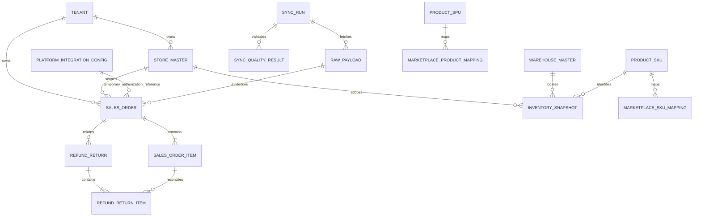

# Commerce ER 图与字段字典

## 1. 关系图

`sales_management` 仍是当前页面与查询原型；本轮不把它接到 `commerce`，也不建立真实平台写入。

## 2. 公共类型规则

| 类别 | 类型 | 规则 |
|---|---|---|
| 主键/外键 | Django `BigAutoField` / `ForeignKey` | MySQL 为 BIGINT；事实删除使用 PROTECT、SET_NULL 或 CASCADE 的显式语义 |
| 平台外部 ID | `CharField(191)` | 不转数字，保留前导零并满足 utf8mb4 索引边界 |
| 金额 | `DecimalField(20,4)` | 禁止 float；业务金额均有非负约束 |
| 币种 | `CharField(8)` | 保存原始 ISO 4217；禁止默认替换未知币种 |
| UTC 时间 | `DateTimeField` | `USE_TZ=True`；店铺业务日另存 `business_date` |
| 哈希 | `CharField(64)` | SHA-256 十六进制；买家/物流只保存不可逆引用哈希 |
| 原始载荷 | 对象存储引用 | 主库不保存大 JSON 或收件 PII |

新增事实模型统一继承 `ValidatedWriteModel`：默认 Manager 与 Django `_base_manager` 均为 `ValidatedManager`；`save()`、`objects.create()`、`bulk_create()` 和 `bulk_update()` 在持久化前执行 `full_clean()`。`QuerySet.update()` 会锁定并逐实例执行受保护的 `save()`，从而兼容 Django Collector 的 `SET_NULL` 删除语义且不绕过业务校验；表达式更新仍被拒绝。派生字段可扩展 `update_fields`，库存更新始终同步持久化重新计算的 `snapshot_key`。

## 3. Commerce 事实表

### `commerce_sales_order`

| 字段组 | 字段 |
|---|---|
| 归属 | `tenant`、`store`、`integration_config NULL`、`source_run NULL`、`raw_payload NULL` |
| 平台键 | `platform(30)`、`region(40)`、`external_order_id(191)` |
| 状态 | `raw_status(80)`、`canonical_status(40)`、`fulfillment_type(40)` |
| 时间 | `created_at_utc`、`paid_at_utc NULL`、`updated_at_utc`、`cancelled_at_utc NULL`、`completed_at_utc NULL`、`business_date`、`ingested_at` |
| 金额 | `currency(8)`、`subtotal_amount`、`seller_discount_amount`、`platform_discount_amount`、`shipping_amount`、`tax_amount`、`order_total_amount` |
| 安全 | `buyer_reference_hash(64)` |

唯一键：`tenant + platform + store + external_order_id`。索引：租户/门店/创建时间，租户/公共状态/更新时间。

### `commerce_sales_order_item`

`order`、`internal_spu NULL`、`internal_sku NULL`、`external_line_id(191)`、`platform_product_id(191)`、`platform_variant_id(191)`、`seller_sku(191)`、商品/规格快照、`quantity`、原价/成交价/折扣/税/行金额、`currency`、`raw_line_status`。

唯一键：`order + external_line_id`。Seller SKU 不是平台唯一身份。

### `commerce_refund_return`

`tenant`、`store`、`order NULL`、`source_run NULL`、`raw_payload NULL`、平台及外部退款/退货 ID、case/raw/canonical/arbitration 状态、原因与责任方、申请/批准/完成时间、平台 `source_updated_at_utc`、币种及退款拆分金额、`return_tracking_reference_hash`。

唯一键：`tenant + platform + store + external_return_id`。订单关联允许为空；CANCELLED 订单不能推断退款。

### `commerce_refund_return_item`

`refund_return`、`order_item NULL`、`internal_sku NULL`、外部退货行/订单行/product/variant ID、Seller SKU 与商品名快照、数量、币种、退款金额。

唯一键：`refund_return + external_return_item_id`，支持一笔退款多个商品行。

### `commerce_inventory_snapshot`

`tenant`、`store`、`warehouse NULL`、`internal_sku NULL`、`source_run NULL`、`raw_payload NULL`、平台 product/variant ID、Seller SKU、`snapshot_key(64)`、在手/可用/预留/在途/待上架/残次数量、`snapshot_at_utc`、`ingested_at`。

唯一键：`tenant + snapshot_key + snapshot_at_utc`。`snapshot_key` 由模型根据 tenant、门店、仓库、内部 SKU、平台 product/variant ID 和 Seller SKU 内部规范化生成；调用方传值会被覆盖，避免 MySQL NULL 唯一键语义或伪造键造成重复快照。

### `commerce_marketplace_product_mapping`

`tenant`、`store`、`platform`、`platform_product_id`、`seller_sku`、`internal_spu NULL`、match status/method/confidence、`confirmed_by NULL`、首次/最后发现时间、`is_active`。

唯一键：`tenant + store + platform + platform_product_id`。

### `commerce_marketplace_sku_mapping`

`tenant`、`store`、`platform`、platform product/variant ID、Seller SKU、`internal_sku NULL`、match status/method/confidence、`confirmed_by NULL`、首次/最后发现时间、`is_active`。

唯一键：`tenant + store + platform + platform_variant_id`。

## 4. Integrations 血缘表

### `integrations_rawpayload`

`tenant`、`sync_run NULL`、`store`、平台、资源类型、外部 ID、schema 版本、内容哈希、加密对象引用、PII 分类、获取/到期/创建时间。没有保存原始 payload 的 JSON/Text 字段。

唯一键：`tenant + platform + store + resource_type + external_id + content_hash`。

### `integrations_syncqualityresult`

`tenant`、`sync_run`、资源类型、检查代码、PASS/WARN/FAIL、期望/实际/缺失/重复/非法数量、脱敏 JSON 详情、检查时间。

唯一键：`tenant + sync_run + resource_type + check_code`。

`SyncJob.resource_type` 明确区分 `sales_order`、`refund_return` 与 `inventory`。RawPayload 资源会先映射到资源族；订单、退款和库存事实只能关联对应资源类型的 SyncRun 与 RawPayload。
